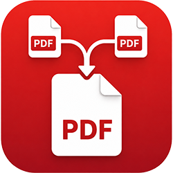
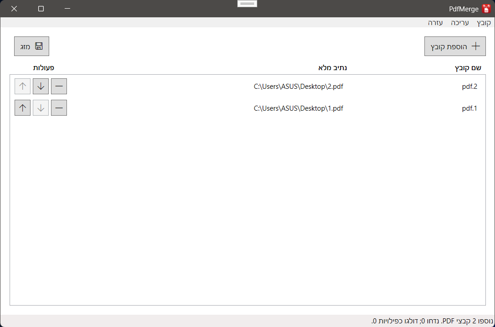

# PdfMerge



PdfMerge is a portable Windows desktop utility for merging multiple PDF files into one output PDF.

It runs locally, keeps settings and logs beside the executable, and supports English and Hebrew.

Current public release target: `v1.0.0`



## Why PdfMerge

- Merges selected PDF files in the visible order.
- Supports drag and drop and the standard Windows file picker.
- Lets users reorder files before merging.
- Writes through a temporary output file before replacing the final PDF.
- Supports English and Hebrew, including right-to-left layout for Hebrew.
- Supports light, dark, and system theme preferences.
- Stays local by default with no server, account, cloud dependency, or telemetry upload.

## Privacy And Data Handling

PdfMerge is designed to keep documents on the local machine:

- no cloud dependency
- no telemetry upload
- no account requirement
- no PDF content indexing
- no input PDF modification

Settings and logs are stored under the portable app folder's `data\` directory.

## License

PdfMerge is licensed under `PolyForm Noncommercial License 1.0.0`.

See:

- [LICENSE](LICENSE)
- [NOTICE](NOTICE)

## Download

The first public release is intended to ship with one Windows `win-x64` asset:

- `PdfMerge-win-x64-portable.zip`

Portable usage:

1. Extract the zip to any writable folder.
2. Run `PdfMerge.App.exe`.
3. PdfMerge stores settings and logs under the extracted folder's `data\` directory.

## System Requirements

- Windows 10 or Windows 11
- `win-x64` for the current packaged release baseline

The portable release is self-contained and does not require a machine-wide .NET runtime installation.

## Main Features

- Local PDF merging
- File picker and drag-and-drop input
- Duplicate PDF skipping
- Selected-file display with file name and full path
- Row-level move up, move down, and remove actions
- Existing-output overwrite confirmation
- Temporary-output safety before replacing the final file
- English and Hebrew localization
- Light, dark, and system theme selection
- Persisted window placement and user preferences
- Local file logging

## Build From Source

From the repository root:

```powershell
dotnet restore .\PdfMerge.sln
dotnet build .\PdfMerge.sln -c Release
.\build\publish-portable.ps1
```

Additional contributor docs:

- [Run locally](docs/run_local.md)
- [Build and publish](docs/build_publish.md)
- [Release checklist](docs/release_checklist.md)
- [Architecture plan](docs/architecture_plan.md)

## Project Status

The first public release target is `v1.0.0`. PdfMerge is intentionally scoped as a simple portable local PDF merger.
